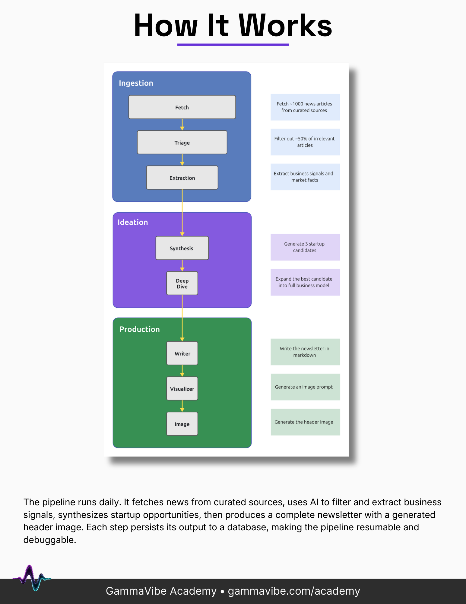
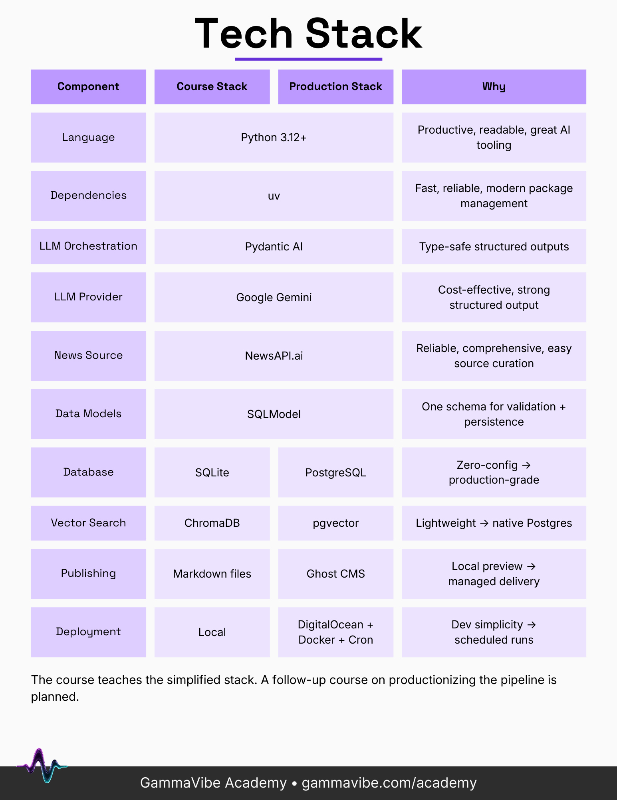

# The Agentic Pipeline - Reference Implementation

An autonomous AI pipeline that turns each day's news into a fully-formed startup idea — complete with a business model, a written newsletter post, a generated header image, and a two-host podcast.

This is the reference implementation from **The Agentic Pipeline** course by [GammaVibe](https://gammavibe.com). It shows **one possible end state**: a working build you can run, read, and learn from. Your own build will diverge based on the decisions you make, what the AI generates, and how you iterate — and that's the point.

- 🎓 **The course** — build this pipeline step by step using agentic engineering. _(course link coming soon)_
- 📘 **Free blueprint:** [gammavibe.com/blueprint](https://gammavibe.com/blueprint) — the architecture, tech stack, and starter prompts (the same files that bootstrapped this repo).
- 🚀 **See it in action:** [gammavibe.com](https://gammavibe.com) — daily posts, images, and podcasts from the production pipeline, plus the full archive.

> **This repo is the destination; the course is the journey.** The README you're reading describes how to run the finished pipeline. To build it yourself from scratch, start with **[BLUEPRINT.md](BLUEPRINT.md)**.

---

## How It Works

The pipeline runs daily. It fetches news from curated sources, uses AI agents to filter articles and extract business signals, synthesizes startup candidates, expands the best one into a full business model, and produces a complete newsletter — written post, header image, and podcast. Every step persists its output to a local database, making the pipeline resumable and debuggable.

(See the [architecture diagram](#diagrams) below.)

---

## Tech Stack

The course teaches the simplified stack with SQLite and ChromaDB and markdown output. The production version uses PostgreSQL and pgvector and publishes to Ghost CMS.

(See the [tech stack diagram](#diagrams) below.)

---

## Quickstart

### Prerequisites

- **Python 3.13+**
- **[uv](https://docs.astral.sh/uv/getting-started/installation/)** for dependency management
- **ffmpeg** — used by the PodcastAudio step to convert the generated audio to MP3 (`brew install ffmpeg`, `sudo apt install ffmpeg`, or `winget install ffmpeg`)
- **Gemini API key** — get a free key at [Google AI Studio](https://aistudio.google.com/api-keys); note: the free tier has rate limits; for sustained use, set up billing in Google Cloud Console
- **NewsAPI.ai API key + Topic Page URI** — sign up at [newsapi.ai](https://newsapi.ai), then create a Topic Page and copy its URI. See [Phase 3: News Ingestion](BLUEPRINT.md#phase-3-news-ingestion) in the blueprint for the Topic Page setup steps. *(For daily production runs you'll want a paid plan — [this referral link](https://gammavibe.com/go/newsapi) gets you a discounted $40 plan; I get a small commission.)*

### Setup

```bash
# 1. Install dependencies
uv sync

# 2. Configure your API keys
cp env.example .env
# then open .env and fill in GEMINI_API_KEY, NEWSAPI_API_KEY, and NEWSAPI_TOPIC_URI

# 3. Create the database
uv run alembic upgrade head

# 4. Run the full pipeline
uv run idea-pipeline run
```

Generated output lands in `output/` (newsletter markdown, header image, podcast script + MP3). The SQLite database and vector store live in `data/`.

### Useful commands

```bash
uv run idea-pipeline run --verbose   # detailed step-by-step logging
uv run idea-pipeline run --resume    # resume the most recent failed/incomplete run
uv run idea-pipeline --help          # all options
uv run pytest                        # run the test suite
```

---

## Build It Yourself

This repo is the finished reference. The course walks through building it from an empty directory using agentic engineering — why each decision is made, how to evaluate what the AI produces, and when to push back.

- Start with **[BLUEPRINT.md](BLUEPRINT.md)** for the architecture, conventions, and the first few build prompts.
- See **[CLAUDE.md](CLAUDE.md)** for the full project conventions that guide the coding agent.

<!-- Full course link coming soon. -->

---

## Diagrams

**Pipeline architecture**



*The diagram shows the core pipeline. The repo also includes bonus **PodcastScript** and **PodcastAudio** steps that turn the finished idea into a two-host audio episode.*

**Tech stack**


